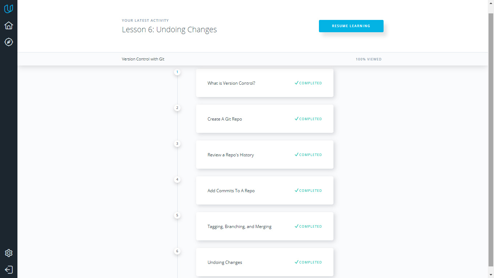
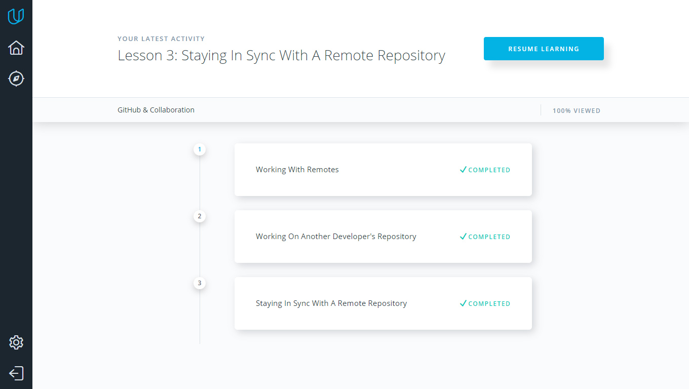
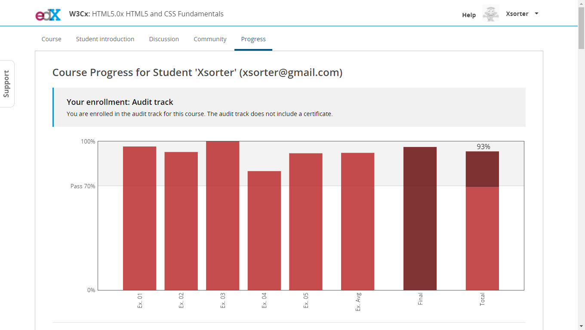
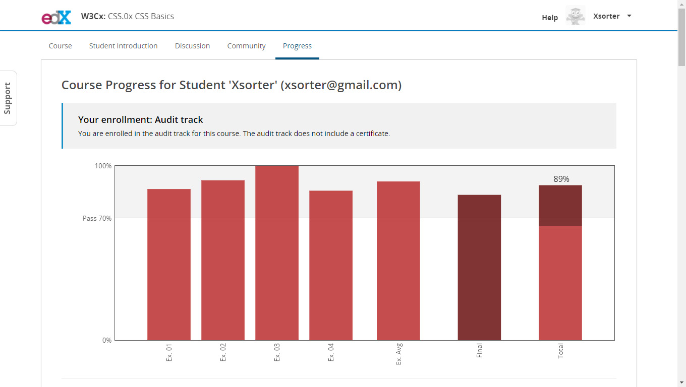

# Kottans frontend course 
## Task 0 (get familiar with Git and Github)

I liked a lot Udemy git course. Especially materials about pull-request and branching was useful for me. 
And, here is my answers to three questions, which was listed in general requirements:

- Materials about pull-requests was totally new for me. Also, information about conflicts, branches and merging was partly new for me too.

- I was suprised, that is the thing like staging area exists in git. Also, the thing about octopus was surprising me too. 

- I totally will use all the things, that i learned during the course. But right now, i will use knowledge about pull-requests. 

## Task 1 (Learn some command line, server and http tools)

During task 1, i learned many new things.

- Mostly, materials from "Networking for Web Developers" was new for me.

- I was surprised on TTL of packets behavior during connection, and how traceroute works with that.

- I will use knowledges of bash commands to work more productive in command line in future. 

**List of completed tasks screenshots:**

1.Linux Command Line Basics

2.Configuring Linux Web Servers

3.Networking for Web Developers

## Task 2 

**List of completed tasks screenshots:**

1.What is Version Control

2.GitHub & Collaboration

## Task 3

HTML5 and CSS Fundamentals

## Task 4

CSS Basics

## Task 5 (Intro to JS)

- So far, this Udemy course is the best in my opinion. Instrucrors bring a lot information in a funny way, but in the same time there was a lot of practical tasks, which helps a lot to understand basic things in JS. For example - loops for two-dimensional arrays, i didn't fully undrestand how it works earlier. But now all seems clear. Oh, and flexboxfroggy was really helpful too!

## Task 6 (Object-Oriented JavaScript)

- Lessons like "Object Decorator Patterns" and "Pseudoclassical Patterns" was kinda complex, but in the end very informative. Very useful last practice task, but i need to do more practice to fully understand OOP things in JS.
Also, thanks for You Don't Know JS book - it's very helpful.

## Task 7 (Offline Web Applications)

- All information in this course was new for me. It was very interesting to know about offline first implementation on web apps. Also, i get useful information about building site skeleton on slow connetcion (or "lie-fi").
 
## Task 8 (Memory - Pair Game)

[Memory - Pair Game on gh-pages](https://xsorter.github.io/kottans_frontend/task_8/)

## Task 9 (Website Performance Optimization)

- It was very useful lesson. Information about CRP and perfomance instrument in Chrome Dev tools was new for me, and i already found where i can implement my new skill. Also, articles from extra materials about V8 and memory management in browser were informative.

