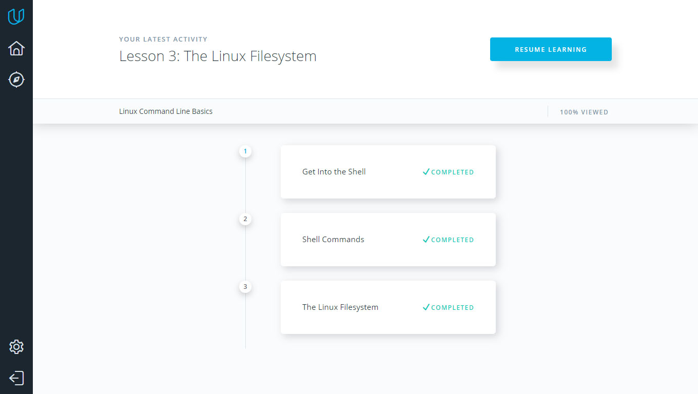
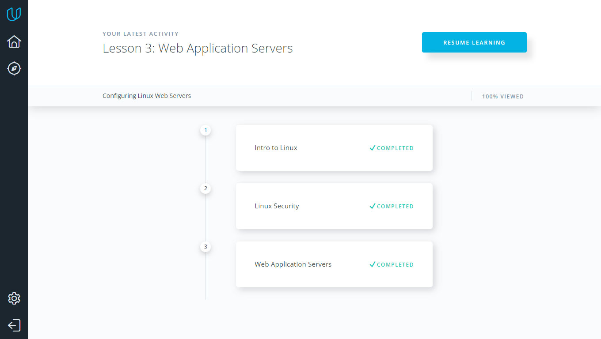
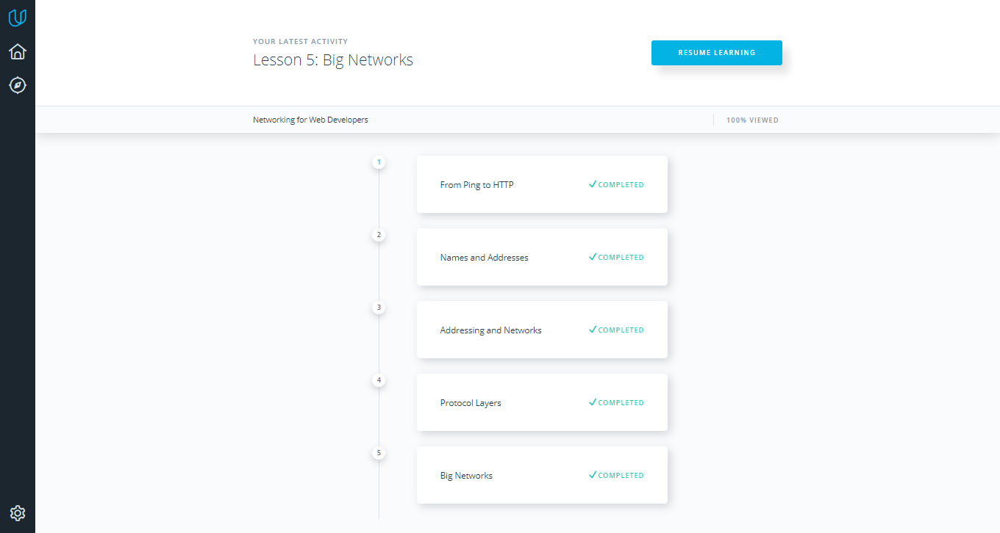

# Kottans frontend course 
## Task 0 (get familiar with Git and Github)

I liked a lot Udemy git course. Especially materials about pull-request and branching was useful for me. 
And, here is my answers to three questions, which was listed in general requirements:

- Materials about pull-requests was totally new for me. Also, information about conflicts, branches and merging was partly new for me too.

- I was suprised, that is the thing like staging area exists in git. Also, the thing about octopus was surprising me too. 

- I totally will use all the things, that i learned during the course. But right now, i will use knowledge about pull-requests. 

## Task 1 (Learn some command line, server and http tools)

During task 1, i learned many new things.

- Mostly, materials from "Networking for Web Developers" was new for me.

- I was surprised on TTL of packets behavior during connection, and how traceroute works with that.

- I will use knowledges of bash commands to work more productive in command line in future. 

**List of completed tasks screenshots:**

1.Linux Command Line Basics

2.Configuring Linux Web Servers

3.Networking for Web Developers
